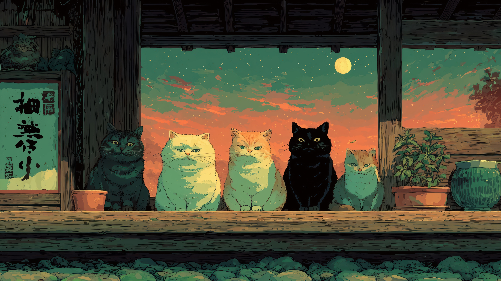
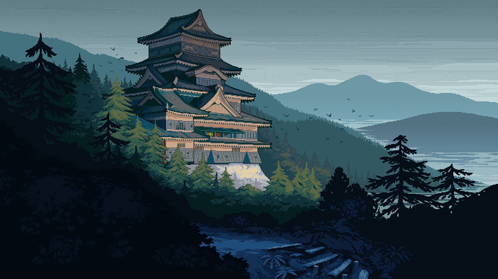

<div align="center">

```
 ██████╗  ██████╗ ██████╗  ██████╗  ███████╗ ██████╗     ███╗   ██╗ ██╗  ██████╗ ██╗  ██╗ ████████╗
██╔════╝ ██╔═══██╗ ██╔══██╗ ██╔══██╗ ██╔════╝ ██╔══██╗    ████╗  ██║ ██║ ██╔════╝ ██║  ██║ ╚══██╔══╝
██║      ██║   ██║ ██████╔╝ ██████╔╝ █████╗   ██████╔╝    ██╔██╗ ██║ ██║ ██║  ███╗ ███████║    ██║
██║      ██║   ██║ ██╔═══╝  ██╔═══╝  ██╔══╝   ██╔══██╗    ██║╚██╗██║ ██║ ██║   ██║ ██╔══██║    ██║
╚██████╗ ╚██████╔╝ ██║      ██║      ███████╗ ██║  ██║    ██║ ╚████║ ██║ ╚██████╔╝ ██║  ██║    ██║
 ╚═════╝  ╚═════╝ ╚═╝      ╚═╝      ╚══════╝ ╚═╝  ╚═╝    ╚═╝  ╚═══╝ ╚═╝  ╚═════╝ ╚═╝  ╚═╝    ╚═╝
```

# 🌌 Copper Night

> *"Where the deep indigo of Tokyo meets the warm glow of an ember sunset."*

A high-performance **Hyprland** rice for **Omarchy** — a **Tokyo Night** palette  
kissed by a **Copper-Orange** border that glows like a setting sun.

<br>

[](https://github.com/hembramnishant50-glitch/omarchy-coppernight-theme)
[](LICENSE)
[](https://hyprland.org)
[](https://omarchy.org/)
[](https://github.com/hembramnishant50-glitch/omarchy-coppernight-theme/stargazers)

</div>

---

<div align="center">


</div>

---

## ▸ 📸 Gallery

<div align="center">

| | |
|:---:|:---:|
|  |  |
|  |  |
|  |  |
|  |  |

</div>

---

## ▸ ⚡ Install

```
$ omarchy-theme-install https://github.com/hembramnishant50-glitch/omarchy-coppernight-theme.git
```

### Then add Waybar *(optional)*

> [!NOTE]
> Your existing Waybar config is automatically backed up before anything is changed.

```bash
# Install dependencies
sudo pacman -S --needed python-requests python-psutil networkmanager \
  papirus-icon-theme pavucontrol bc zenity jq curl
sudo systemctl enable --now NetworkManager
pip install psutil

# Backup existing Waybar config
if [ -d ~/.config/waybar ]; then
    BACKUP_NAME="waybar-backup-$(date +%d-%m-%Y)-$RANDOM"
    mv ~/.config/waybar ~/.config/"$BACKUP_NAME"
    echo "Backed up to ~/.config/$BACKUP_NAME"
fi

# Apply Copper Night Waybar
mkdir -p ~/.config/waybar
SOURCE_DIR="$HOME/.config/omarchy/current/theme/waybar"

if [ -d "$SOURCE_DIR" ]; then
    cp -r "$SOURCE_DIR"/* ~/.config/waybar/

    if [ -d ~/.config/waybar/scripts ]; then
        chmod +x ~/.config/waybar/scripts/*
        # Force system Python to prevent environment conflicts
        find ~/.config/waybar/scripts -type f -name "*.py" \
          -exec sed -i '1s|^#!/usr/bin/env python3|#!/usr/bin/python3|' {} +
    fi
fi

# Apply Papirus Dark icons & restart Waybar
gsettings set org.gnome.desktop.interface icon-theme 'Papirus-Dark'
killall -q waybar; nohup waybar > /dev/null 2>&1 &
```

---

## ▸ 🪟 Waybar — Pick a Variant

> [!WARNING]
> All variants require the theme install above (and **Step 2** for the default Waybar).

```
  1) Default             → pre-installed with the theme
  2) Pill Style          → EXTRA/WAYBARS/waybar-1 · ./Setup-Waybar.sh
  3) Ember Arc           → EXTRA/WAYBARS/waybar-2 · ./waybar-setup.sh
  4) Pastel Capsule      → EXTRA/WAYBARS/waybar-3 · ./waybar-setup.sh
  5) Catppuccin Capsule  → EXTRA/WAYBARS/waybar-4 · ./waybar-setup.sh
```

### 1 · Default Waybar

<div align="center">

<p><em>Clean and minimal — ships out of the box with the full install.</em></p>
</div>

### 2 · Waybar-1 — Pill Style

<div align="center">

<p><em>Neon pill borders · Rounded segments · Compact & clean</em></p>
</div>

```bash
cd ~/.config/omarchy/current/theme/EXTRA/WAYBARS/waybar-1 \
  && chmod +x Setup-Waybar.sh && ./Setup-Waybar.sh \
  && chmod +x ~/.config/waybar/scripts/*
```

### 3 · Waybar-2 — Ember Arc

<div align="center">

<p><em>Copper warmth · Floating arcs · Glows like a setting sun</em></p>
</div>

```bash
cd ~/.config/omarchy/current/theme/EXTRA/WAYBARS/waybar-2 \
  && chmod +x waybar-setup.sh && ./waybar-setup.sh
```

### 4 · Waybar-3 — Pastel Capsule

<div align="center">

<p><em>Neon pastel · Rounded capsules · Floating in a dark sky</em></p>
</div>

```bash
cd ~/.config/omarchy/current/theme/EXTRA/WAYBARS/waybar-3 \
  && chmod +x waybar-setup.sh && ./waybar-setup.sh
```

### 5 · Waybar-4 — Catppuccin Mocha Capsule

<div align="center">

<p><em>Catppuccin Mocha · Copper borders · Rounded capsules with workspace circles</em></p>
</div>

```bash
cd ~/.config/omarchy/current/theme/EXTRA/WAYBARS/waybar-4 \
  && chmod +x waybar-setup.sh && ./waybar-setup.sh
```

---

## ▸ 🌤️ Weather Widget

No more editing scripts. **One click** updates your city.

```
click →  type city  →  enter
  🌡️     "London"     ✓ done
  ☀️     "Tokyo"      ✓ saved
  🌧️     "Patna"      ✓ instant
```

> [!TIP]
> Your city is saved automatically. To refresh, click the icon again or run `killall waybar; waybar &`.

---

## ▸ 🔒 Lock Screen

<div align="center">


*Glassmorphism lock screen with live clock, random quotes, and media controls*

</div>

### Setup

> [!WARNING]
> Complete the theme install before running this.

```bash
# 1. Install Playerctl (required for media key support)
sudo pacman -S --needed playerctl

# 2. Fix Spotify media controls (Flatpak only)
if command -v flatpak &> /dev/null; then
    flatpak override --user \
      --talk-name=org.mpris.MediaPlayer2.spotify \
      com.spotify.Client
fi

# 3. Copy lock screen config files
mv ~/.config/hypr/hyprlock.conf ~/.config/hypr/hyprlock.conf-Backup && \
cp -r ~/.config/omarchy/current/theme/scripts \
      ~/.config/omarchy/current/theme/quotes.txt \
      ~/.config/omarchy/current/theme/hyprlock.conf \
      ~/.config/hypr/

# 4. Make scripts executable
chmod +x ~/.config/hypr/scripts/*
```

<details>
<summary><b>⚠️ Fix: Black Screen on Lock</b></summary>

If your screen goes black when locking, apply this quick fix.

**1. Open the file:**

```bash
nano ~/.local/share/omarchy/bin/omarchy-system-lock
```

**2. Find this line at the bottom:**

```bash
omarchy-brightness-display off
```

**3. Comment it out by adding `#` at the start:**

```bash
# omarchy-brightness-display off
```

**4. Save and exit:** `Ctrl+O` → `Enter` → `Ctrl+X`

</details>

### Customize

```bash
nano ~/.config/omarchy/current/theme/hyprlock.conf
```

```ini
# Wallpaper
background {
    monitor =
    path = /home/YOUR_USER/Pictures/your-wallpaper.jpg
    blur_passes = 3   # 0 = sharp · 3 = soft glass · 5+ = dreamy
    blur_size   = 7
}

# Profile Picture
image {
    monitor =
    path = /home/YOUR_USER/Pictures/your-avatar.png
    size = 150
}
```

| `blur_passes` | Effect |
|:---:|:---|
| `0` | Sharp — no blur |
| `2` | Subtle — light frost |
| `3` | Standard — soft glass |
| `5+` | Heavy — dreamy glow |

### Restore the original

```bash
rm ~/.config/hypr/hyprlock.conf \
  && mv ~/.config/hypr/hyprlock.conf-Backup ~/.config/hypr/hyprlock.conf
```

---

## ▸ ✨ Features

`◆ = enabled out of the box`

| | Feature | What you get |
|:---:|:---|:---|
| ◆ | **Wallpaper** | Traditional Japanese Pixel Art Pagoda — handpicked for the aesthetic |
| ◆ | **Widgets** | Floating diagnostic panels with custom animated resource bars |
| ◆ | **Color Palette** | Deep Indigos · Electric Magentas · Warm Copper-Orange accents |
| ◆ | **Weather Widget** | Live weather with click-to-change city — no script editing needed |
| ◆ | **Lock Screen** | Glassmorphism Hyprlock with blur, quotes, and media controls |
| ◆ | **Media Controls** | Playerctl integration with full Spotify Flatpak support |
| ◆ | **5 Waybar Variants** | Pick your vibe — Default, Pill, Ember Arc, Pastel, Catppuccin |

---

## ▸ 🗂️ Theme Files

One install themes your **entire desktop** — here's the layout:

```
~/.config/omarchy/current/theme/
├── hyprland.conf          Hyprland WM
├── hyprlock.conf          Lock screen
├── waybar/                Waybar · 5 variants
├── mako.ini               Notifications
├── swayosd.css            On-screen display
├── walker.css             App launcher
├── wofi.css               Wofi launcher
├── gtk.css                GTK apps
├── alacritty.toml         Terminal
├── kitty.conf             Terminal
├── ghostty.conf           Terminal
├── foot.ini               Terminal
├── warp.yaml              Terminal
├── gum.env.conf           Gum styling
├── neovim.lua             Editor
├── helix.toml             Editor
├── vscode_colors.json     VSCode
├── obsidian.css           Obsidian
├── vencord.theme.css      Discord
├── tokyo-night.theme.css  Discord · Tokyo Night
├── theme.override.css     Browser
├── chromium.theme         Chromium flags
├── btop.theme             Btop
├── cava_theme             Cava
├── keyboard.rgb           RGB keyboard color
├── icons.theme            Papirus-Dark icons
├── quotes.txt             Lock screen quotes
├── scripts/               Lock screen helpers
└── backgrounds/           5 wallpapers
```

---

## ▸ 🎨 Color Palette

<div align="center">

| Background | Deep Indigo | Electric Blue | Magenta | Copper-Orange | Foreground |
|:---:|:---:|:---:|:---:|:---:|:---:|
|  |  |  |  |  |  |
| `#11111b` | `#565f89` | `#7aa2f7` | `#bb9af7` | `#fab387` | `#c0caf5` |

</div>

> 💡 **Copper-Orange** `#fab387` is the signature accent — it glows through window borders, Waybar modules, and the lock screen.

---

## ▸ 🖼️ Wallpapers

> [!NOTE]
> All wallpapers ship with the theme, optimized for dark desktop aesthetics.

### 🌙 Featured — Cats at Moonrise

<div align="center">



*Five cats perched before a copper sunset — the spirit of Copper Night in one frame.*

</div>

<div align="center">

| | |
|:---:|:---:|
|  |  |
| ⚔️ **The Last Swordsman** · *Dark Fantasy* | 👺 **Girl & Hannya** · *Monochrome Yokai* |
|  |  |
| 🏯 **Mountain Castle** · *Pixel Art* | 🪶 **Itachi & The Crows** · *Akatsuki* |

</div>

| Wallpaper | File | Style | Resolution |
|:---|:---|:---|:---:|
| 🐱 Cats at Moonrise | `backgrounds/cats-anime.jpg` | Lofi · Ghibli | 3840 × 2160 |
| 🏯 Mountain Castle | `backgrounds/japanese-castle-pixel-digital-art.jpg` | Pixel Art | 3840 × 2160 |
| ⚔️ The Last Swordsman | `backgrounds/Character with Glowing Eyes and Katana.jpg` | Dark Fantasy | 3840 × 2160 |
| 👺 Girl & Hannya | `backgrounds/Girl with Hannya Mask.jpeg` | Monochrome · Yokai | 3000 × 1688 |
| 🪶 Itachi & The Crows | `backgrounds/Itachi Uchiha.jpg` | Naruto · Akatsuki | 3840 × 2160 |

---

## ▸ 🤝 Contribute

Contributions are warmly welcome!

```
git checkout -b feat/your-idea
git commit -m "feat: add your idea"
git push && open a Pull Request
```

---

<div align="center">

Made with 🧡 for **Omarchy**

*If this theme made your desktop beautiful, consider leaving a ⭐ — it means a lot!*

[](https://github.com/hembramnishant50-glitch)

</div>
